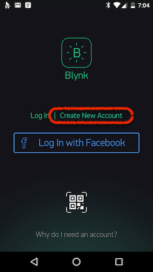
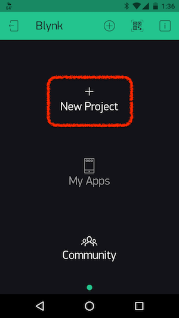
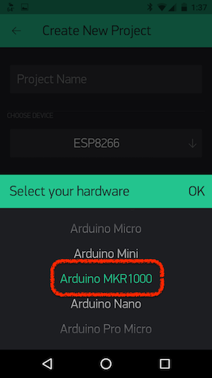
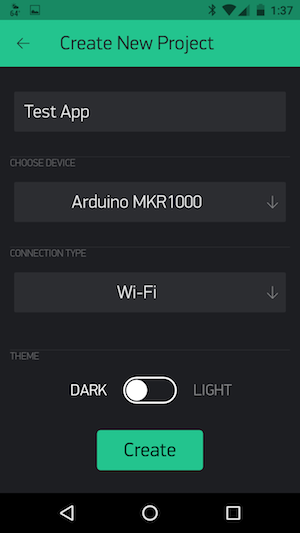
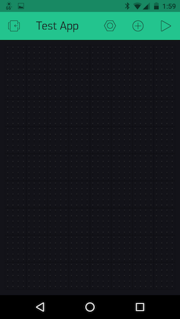
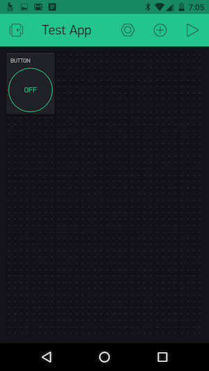
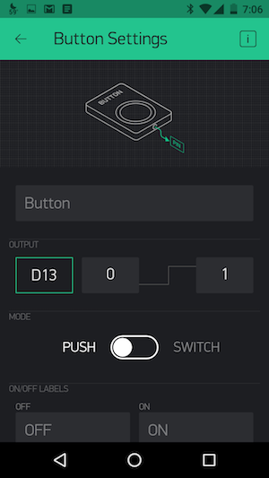
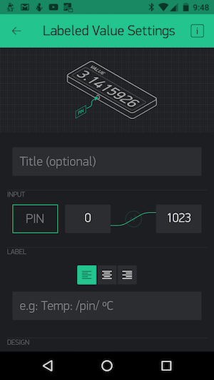

In this tutorial you will be introduced to the [Blynk](https://www.blynk.cc/) platform for IoT.  Blynk is a platform with iOS and Android apps to control microcontrollers over the Internet.  It enables the quick prototyping of a graphic interface for your project by simply dragging and dropping widgets.

## Getting Started with Blynk

1.  Install the Blynk library in the Arduino IDE

    1.  Launch the Ardunio IDE.

    1.  From the main menu, choose Sketch --> Include Library --> Manage Libraries.

    1. In the "Filter your search..." textbox, enter Blynk

    1.  The first entry in the search results should be "Blynk by Volodymyr Shymanskyy."  Click the Install button to install the latest version.

    1.  Click "Close" to return to the main interface.

1. Open the sample Blynk sketch for the Feather M0:  File --> Examples --> Blynk --> Boards_WiFi --> Adafruit_Feather_M0_WiFi

1. On your mobile device, download and install the Blynk app:

    <a href="https://play.google.com/store/apps/details?id=cc.blynk"><button data-md-color-primary="green">Blynk for Android</button></a>

    <a href="https://itunes.apple.com/us/app/blynk-control-arduino-raspberry/id808760481?ls=1&mt=8"><button data-md-color-primary="green">Blynk for IoS</button></a>

    1.  Launch the app on your mobile device.

    1.  Click on the "Create New Account" link:

        

    1. Enter your email and set up a password.  Blynk uses your email to send authorization tokens so if you prefer not to use your own current email address, consider setting up a Gmail account specifically for this purpose.

    1. Click "Sign Up" and you will be authenticated to the Blynk cloud server.

1. Next, create your first Blynk app:

    1.  Click on "New Project"

        

    1. Give your new project a name.

    1. Under choose device, look for "Adafruit Feather M0."  If you are unable to locate it, choose "Arduino MKR1000" which uses the same SAMD chip and WiFi101 library as the Feather M0.  Alternatively, you can use the "Generic Board" with the connection type "Wi-Fi."

        

    1. Finally, decide if you want to have a dark or light theme/background for your app.

        

    1. Finally, click the Create button.

1.  The Blynk mobile application will notify you that it has sent an app-specific Auth Token to your email address.  Later we will copy this into the Arduino sketch you opened in step #2 above.

1. You will next be presented with a blank canvas for your app, which you can populate with [Blynk widgets](http://docs.blynk.cc/#widgets).  

    

    Widgets are Blynk's interface modules, and are used to perform a specific input or output function when communicating with your Feather M0.

    !!! Note
        While Blynk is free to use, they limit the number of widgets you can use in a particular app under the free account.  You have a total of 2,000 credits to "spend" on widgets.  When you delete an app, the credits used by the widgets in that app are returned to your account balance.  You can also "recycle" widgets in an existing application, removing it from the app and replenishing your credits.

        

    Let's begin by creating a simple Blynk app that controls the on-board LED (pin 13) on the Feather M0.

    1.  Click on the **+** icon at the top of the app canvas.

        

    1.  Spend a little time familiarizing yourself with the available widgets.  Click on the [i] icon to read about each one.

    1.  Select the [Button widget](http://docs.blynk.cc/#widgets-controllers-button) and it will be added to your app canvas.

          
        
        You can press and hold the button widget to position it on your canvas and/or resize it.

    1. Tap once on the Button widget to access its properties.  In this case we want the Button widget to control the Feather's on-board LED at pin 13.  Touch the green outlined output box and choose Digital Pin 13.

        

        Here you can also decide if you want the widget to be a button or a switch, as well as set labels, font size and font color.  When set as a **button**, the widget will function as a momentary "on" tactile button, which remains on only for the duration of the button press.  When set as a **switch**, the button will toggle between the on and off position, "latching" in place until it is tapped again.

    1.  Tap the back arrow to return to the app canvas.

1.  You're now ready to test out your app.  This is a two-step process:

    1. First, press the "play" button on the Blynk canvas.  This will switch the Blynk interface to "playback" mode.  In this mode, tapping your Button widget will operate the button itself instead of bringing up its settings menu.

        

    1.  Next, we need to configure the Adafruit_Feather_M0_WiFi sketch and upload it to the Feather:

        * By now you should have received the Auth Token email from Blynk.  Check your email inbox and copy the token (a long string of letters and numbers that will associate your Blynk app with your specific Feather M0)
        * Return to the Arduino IDE application.  In the Adafruit_Feather_M0_WiFi sketch, find line 38.  Replace `YourAuthToken` within the quotes with your actual Auth Token.
        * On lines 42 and 43, enter your WiFi network name, replacing `YourNetworkName` and, if required, your network password replacing `YourPassword`.

            !!! important

                For Duke's network, these lines should read:

                ```arduino
                    char ssid[] = "DukeOpen";
                    char pass[] = "";
                ```
                
        * Save the sketch (you will be prompted to give it a new name.)
        * Plug your Feather M0 into your USB port.  In Arduino, make sure you have "Adafruit Feather M0" selected under Tools --> Board and the proper USB port under Tools --> Port.
        * Verify and then Upload the sketch.

    1.  Return to the Blynk app on your mobile device.  Tapping the button should flash the Feather's built-in LED on if the Button widget was set to "button" mode.  If set to "switch" mode, each tap will toggle the LED either on or off.

Congratulations!  You've created your first Blynk app.  Blynk offers a range of [controller widgets](http://docs.blynk.cc/#widgets-controllers) -- buttons, sliders, timers, two-axis joysticks, step control, and RGBa color pickers.  These can be used to control LEDs, motors, relays, solenoids, etc.

---

## Blynk's Display Widgets

Now let's explore some of Blynk's [display widgets](http://docs.blynk.cc/#widgets-displays) which allow you to display and chart data sent from your Feather microcontroller and any attached sensors.  

1. Hook up a sensor of your choosing to your Feather M0. Some possibilities include:

    * [Temperature Sensor](https://learn.adafruit.com/tmp36-temperature-sensor/using-a-temp-sensor) (the TMP36 is in your Redboard Inventor's Kit)

    * [Light Sensitive Resistor](https://learn.sparkfun.com/tutorials/photocell-hookup-guide)

    * Potentiometer

    !!! important

        The Feather M0 operates at 3.3V logic level! 

1. In the mobile Blynk app, add a new widget to your canvas by tapping on the **+** icon.  Scroll down to find the Display widgets and choose the "Labeled Value" widget.

1.  It will appear as an empty box on your canvas.  Press and hold to resize and/or re-position the widget.

1. Tap once on the widget to access its settings:

    

    1. Title: Optional, but useful to specify the sensor.

    1. Pin (outlined in green):  Choose the pin from which you want to read the sensor (usually an analog input pin).

    1. To the right of the pin setting you can specify the expected _or_ mapped values:

        * Expected values -- these are the "raw" values read by the microcontroller's ADC (analog to digital converter).  [The Adafruit Feather M0's analog input pins are read at 12-bit resolution, so you will want to change the upper value from 1023 to 4096 to reflect this higher resolution.]

            

        * Mapped values -- While you know how to use Arduino's `map()` function to remap sensor values to different scales within the Arduino sketch itself, Blynk allows you to map incoming values in the mobile app itself.  Note the curved line connecting the lowest sensor value to the highest.  

            
        
            If you tap that line, a greyed out circle with amplitude becomes active, indicating that instead of passing along raw values, Blynk will map the incoming values to the range you specify.

            

            So if you wanted to map your sensor to values 0 to 100, simply use that as a range and Blynk will automatically do the mapping for you!

    1. By default, this widget will show the values only, but you can format the output to include labels.  For example, if your sensor sends the value 75.385, you can use the following syntax to modify the numerical display:

        * `/pin/` will display: _75.385_ (the default)
        * `/pin./` will display a rounded, non-decimal value: _75_
        * `/pin.#/` will display the value with 10ths of an integer resolution:  _75.4_
        * `/pin.##/` will display the value with 100ths of an integer resolution: _75.39_

        as well as add labels:

        * `value: /pin./` will display: _value 75_
        * `/pin.#/ %` will display: _75.4 %_
        * `level: /pin/ microns` will display: _level: 75.385 microns_

    1. Finally, you can decide how often you want the blynk app to query your hardware.  Default is every 1 second.

1.  Tap the back arrow to return to your canvas.

1.  Press the "play" button on your Blynk canvas.  If your Feather M0 is connected and the sensor properly wired, you should see values updating in the labeled display immediately!

---

## Challenge - Twitter or Email

Challenge yourself to create an application that triggers a Tweet or email when a sensor hits a particular threshhold.

[http://docs.blynk.cc/#widgets-notifications](http://docs.blynk.cc/#widgets-notifications)


