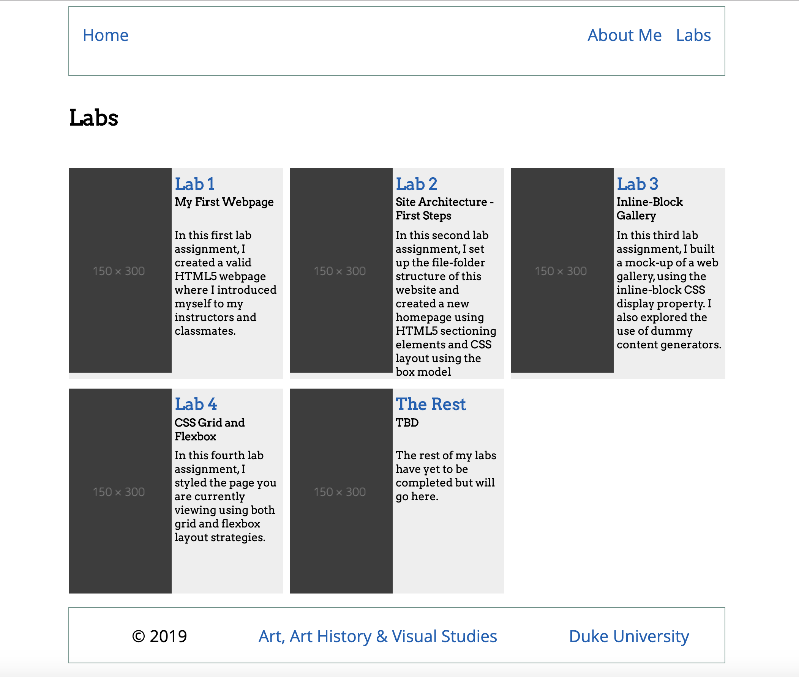
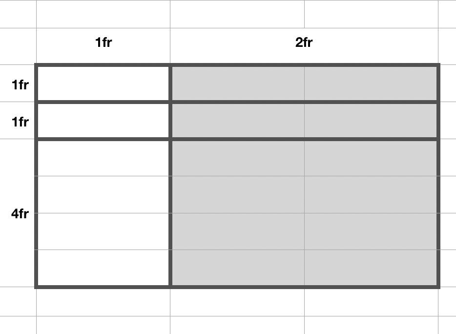

!!! danger ""
    Due:  _**_Second_ Lab Section meeting of the week of September 30<sup>th</sup>**_

## **CSS Grid and Flexbox**

### Overview

In this fourth lab assignment, you will create a mock-up of a Labs landing / index page. You will use both CSS Flexbox and Grid techniques to layout the components for this page.  The concept here is that you will have a single page available at https://people.duke.edu/~netID/labs/lab04/index.html which will display information about and link to each of the labs you've completed so far this semester.

The page should be structured as follows (see screenshot below for a visual representation) and ideally should be accomplished without modifying the _structure_ of the HTML document provided below.  In other words, as much as possible, leave the HTML alone and design with CSS only.

*  All major elements on the page (`<header>`, `<main>`, and `<footer>`) should be centered on the page with a maximum width of 960 pixels. 

* Flexbox should be used to create a horizontal layout for the navigation links.   The "Home" link should be positioned on the left-hand side of the navigation element, with the remaining links on the right side.

*  A grid container should define the layout of the main elements of the page, a series of `<article>` elements containing information on each of the labs you've completed this semester.

* At the base of the page will be a footer element using Flexbox for layout with copyright and links to both Duke University and to your primary department webpage.

*  Use two Google typefaces/fonts, a sans-serif font for the header and footer content, and a serif font for the main content.  Be sure to select typefaces that are legible and sympathetic when occupying the same page.

*  Use a three-color color scheme for this page. One “highlight” color should be used in light weight to define the extents of the navigation and footer elements, one “text color” with strong legibility (low saturation, dark value/tone) should be used for all text, and a third color should be used as either a subtle background/panel/object color or within the article elements. Color schemes must be generated from an online color palette generator (color.adobe.com, colormind.io, etc.).



### Requirements for a &#10003;

Use the following step-by-step to make sure you meet the minimum requirements to earn a **&#10003;** for this assignment.  Scroll down to the [Reach Goals](#reach-goals-for-a) section below for suggestions to extend your work to attain a **&#10003;+**.

1.  Launch Brackets.

1.  In your local website directory, create a new .css file in your `/css` folder, naming it `lab04.css`.

2.  In your `/labs` folder, create a new folder called `lab04`.  Inside of the newly-created `lab04` folder, create a file named `index.html`

3.  Copy and paste the following HTML into your newly-created `index.html` file and save it:

    ```html
    <!DOCTYPE html>
    <html>

        <head>
            <meta charset="UTF-8">
            <meta name="viewport" content="width=device-width, initial-scale=1">
            <title>Labs Landing Mockup</title>
            <link href="../../css/lab04.css" type="text/css" rel="stylesheet">
        </head>

        <body>
            <header>
                <nav>
                    <ul id="nav-links">
                        <li id="home"><a href="../../index.html">Home</a></li>
                        <li><a href="../../about-me.html">About Me</a></li>
                        <li><a href="../../labs/index.html">Labs</a></li>
                    </ul>
                </nav>
            </header>
            <main id="labs-grid">
                <h1 id="page_title">Labs</h1>
                <article id="lab1" class="lab_item">
                    <h2 class="lab_number"><a href="../lab01/index.html">Lab 1</a></h2>
                    
                    <h3 class="lab_title">My First Webpage</h3>
                    <p class="lab_description">In this first lab assignment, I created a valid HTML5 webpage where I introduced myself to my instructors and classmates. </p>
                </article>
                <article id="lab2" class="lab_item">
                    <h2 class="lab_number"><a href="../lab02/index.html">Lab 2</a></h2>
                    
                    <h3 class="lab_title">Site Architecture - First Steps</h3>
                    <p class="lab_description">In this second lab assignment, I set up the file-folder structure of this website and created a new homepage using HTML5 sectioning elements and CSS layout using the box model </p>
                </article>
                <article id="lab3" class="lab_item">
                    <h2 class="lab_number"><a href="../lab03/index.html">Lab 3</a></h2>
                    
                    <h3 class="lab_title">Inline-Block Gallery</h3>
                    <p class="lab_description">In this third lab assignment, I built a mock-up of a web gallery, using the inline-block CSS display property.  I also explored the use of dummy content generators.</p>
                </article>
                <article id="lab4" class="lab_item">
                    <h2 class="lab_number"><a href="./index.html">Lab 4</a></h2>
                    
                    <h3 class="lab_title">CSS Grid and Flexbox</h3>
                    <p class="lab_description">In this fourth lab assignment, I styled the page you are currently viewing using both grid and flexbox layout strategies.</p>
                </article>
                <article id="the_rest" class="lab_item">
                    <h2 class="lab_number"><a href="./index.html">The Rest</a></h2>
                    
                    <h3 class="lab_title">TBD</h3>
                    <p class="lab_description">The rest of my labs have yet to be completed but will go here.</p>
                </article>
            </main>

            <footer>
                <ul id="footer-items">
                    <li>&copy; 2019</li>
                    <li><a href="https://aahvs.duke.edu">Art, Art History &amp; Visual Studies</a></li>
                    <li><a href="https://www.duke.edu">Duke University</a></li>
                </ul>
            </footer>
        </body>
    </html>
    ```
    Ideally, you won't need to modify the HTML on this page.  Save it and use CSS exclusively for layout and design.

1. Return to the `lab04.css` file and begin styling the document using CSS.

1. The first two lines of your CSS file should contain `@import` rules that pull in two separate font CSS from [Google Fonts](https://fonts.google.com/).  One font should be serifed, the other a sans-serif font.

1.  Use the appropriate `font-family` CSS declarations to use the sans-serif font for the `<header>` and `<footer>` elements, and the serifed font for the `<main>` element.

1.  The `<header>` of your page should be an element spanning 100% of the width of the page and use flexbox to center its children (e.g. the `<nav>` element.):

    ```css
    header {
        display: flex;
        justify-content: center;
        width: 100%;
        align-items: center;
    }
    ```

1.  The navigation bar (`<nav>`) of your page should be styled to display at a height of 100px and a width of 960 pixels.  Use the `box-sizing: border-box;` declaration so that border and padding are not calculated into the width of the box model for `<nav>`.  You can give it a border that fits in with your three-color scheme.

1. Use flexbox for horizontal layout of the navigation links:

    ```css
    #nav-links {
        list-style-type: none;
        display: flex;
        justify-content: flex-end;
    }
    ```
    
1.  The "Home" link should be positioned at the _left_ of the `<nav>` element, by specifying the `flex` property of the `#home` element.  

1.  Use appropriate padding to space out the navigation elements and ensure that you have 20 pixels between the "Home" link and the navigation element's left edge and between the last menu item and the navigation element's right edge.


1. The grid container for the labs (`#labs-grid`) should be given a maximum width of 960 pixels and centered on the page using the `margin: 0 auto;` technique.

1.  The grid container for the labs should also be set to `display: grid;`  The grid columns should be set to make 3 columns of 1 fractional width each: `grid-template-columns: 1fr 1fr 1fr;` and the grid rows should be set so that the first row is 100 pixels high and the rest are auto-sized:  `grid-template-rows: 100px auto;`

1.  Set the gap between rows to 15 pixels and the gap between columns at 10 pixels.

1.  Use the `grid-column` declaration to set the `#page-title` element to span all three columns (e.g. from the first grid-line to the fourth.)

1. Now turn your attention to the `<article>` elements.  Use CSS grid to layout the content of each `.lab-item` info card with the following fractional widths designating 2 columns and 3 rows:

    

    ```css
    .lab_item {
        display: grid;
        grid-template-columns: 1fr 2fr;
        grid-template-rows: 1fr 1fr 4fr;
    }
    ```

1. Use `grid-template-areas` to specify this layout of elements in the `.lab-item` grid:

    

    ```css
        grid-template-areas:
            "image number"
            "image title"
            "image description";
    ```

    and then be sure to assign your HTML elements to those named areas:

    ```css
    .lab_image { grid-area: image; }
    .lab_number{ grid-area: number; }
    .lab_title { grid-area: title; }
    .lab-description { grid-area: description; }
    ```

1. Employ your three-color color scheme.

1. Use `padding` and `grid-column-gap` and `grid-row-gap` to introduce some breathing room into your design.

!!! important
    
    Be sure to save your work and then SFTP the changes you've made to your local directory to your `public_html` directory on the `people.duke.edu` webserver:
    
    * The folder `lab04` containing the index.html file should be transferred into the `labs` folder of your `public_html` directory on the webserver.

    * The file `lab04.css` should be transferred to the `css` folder in the `public_html` directory on the webserver.

### Reach Goals

Use `@media` queries to make the page layout responsive to smaller screens.  For example, you may wish to have the layout switch to a two-column grid of labs below 640px and to a single column grid below 400px.  

And/or you may want the grid layout of the `.lab-item` info cards themselves to change at lower resolutions. 

Use relative font-sizing (`rem`) to set the font-size of different elements on the page.

And, as always, leverage what you've learned about CSS more generally to create an aesthetically-pleasing webpage.