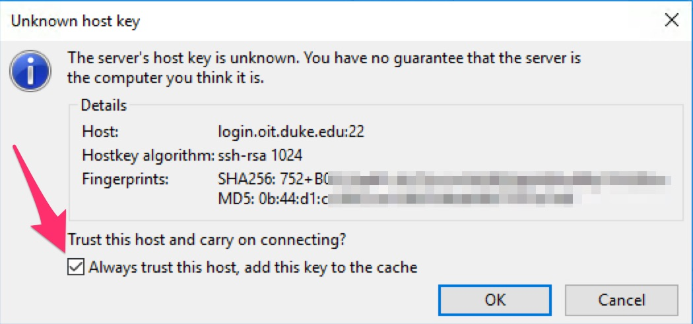

!!! danger ""
    Due:  _**First Lab Section meeting of the week of September 2**_

## **My First Webpage**


In this first lab assignment, you will mark up a valid HTML5 webpage that introduces yourself to your instructors and classmates.  

## Requirements for a &#10003;

Use the following checklist to make sure you meet the minimum requirements to earn a **&#10003;** for this assignment.  Scroll down to the [Reach Goals](#reach-goals-for-a) section below for suggestions to extend your work to attain a **&#10003;+**.

* [ ] In [Brackets](http://brackets.io) or text editor of your choice, create a single html page with a file name of `about-me.html` 

    !!! warning
    
        Be sure to save your file early and often so that you don't lose your work.  
        
        It is also a good idea to create a single folder on your computer where you will store local copies of all of your labs throughout the semester.  (Later we'll cover [Github](https://github.com), which will give you an additional mechanism for backing up and versioning your files.)

        

* [ ] Use the HTML5 boilerplate introduced in the first lecture as a starting point:
    
    ```html
    <!DOCTYPE html>
    <html>
        <head>
            <meta charset="UTF-8">
            <title>Title of the document</title>
        </head>
        
        <body>
        
        </body>
    </html>
    ```

* [ ] Use proper semantic markup to give your page a hierarchical structure (e.g. an `<h1>` element for the main heading of the page, and `<h2>` and `<h3>` elements to designate subheadings).
* [ ] Use a variety of inline and block HTML elements in your page:  paragraphs, ordered or unordered lists, horizontal rules, underline and highlight text, etc.

    !!! tip

        Some good resources to consult for the basics of HTML markup are:
        
        * [w3schools.com's HTML5 tutorial](https://www.w3schools.com/html/default.asp)
        * [Mozilla's HTML Cheat Sheet](https://developer.mozilla.org/en-US/docs/Learn/HTML/Cheatsheet)
        * [HTML.com's HTML Cheat Sheet PDF](https://html.com/wp-content/uploads/html-cheat-sheet.pdf)

* [ ] Your page should contain at least one hyperlink to an external webpage.
* [ ] Display at least one image on your page using the `` element.
    * [ ] Find an image online that you like and determine its absolute file path.
    * [ ] Use that path in the `src` attribute of the `` element.
    * [ ] Use the `alt` attribute of the `` element to describe the image for those who might be unable to see it.

    !!! tip

        To determine the absolute file path of an image in a webpage, right-click on it in your browser and choose "View Image" (in Firefox) or "Open Image in New Tab" (in Chrome).  You can then copy the full URL of the image as it appears in the browser's address bar.

* [ ] Your html file should be transferred to the `public_html` directory of your `people.duke.edu` CIFS space using FileZilla.

* [ ] Your file should be viewable at `https://people.duke.edu/~yourNetID/about-me.html` (e.g. if your Duke netID is `wilma`, then your page should be viewable at `https://people.duke.edu/~wilma/about-me.html`).

* [ ] Email your instructor with the link to your first webpage!


## Reach Goals for a &#10003;+

To earn a **&#10003;+** on this assignment, push yourself to achieve at least two of the following:

* [ ] Add some CSS inside the `<style></style>` element in the `<head>` section of your document to modify the design of your page (text color, text font family, page background color, etc)
* [ ] Determine which attribute can be added to a link tag in order to cause the linked page to open in a _new tab_ in your browser.
* [ ] Use the HTML markup for a _definition list_ to define these HTML concepts: relative file path, absolute file path. 
* [ ] Properly use the HTML5 `<section>` element in your page's HTML.


## FileZilla SFTP Instructions for Duke CIFS Space "people.duke.edu"

The FileZilla application will allow you to transfer your `about-me.html` file from your computer's harddrive to your `public_html` directory on the `people.duke.edu` webserver.

1. Launch FileZilla.

1. In the QuickConnect bar, enter the following:

    * Host:  `login.oit.duke.edu`
    * Username:  `<your netID>`
    * Password:  `<your netID password>`
    * Port: 22
    

1.  Click the Quickconnect button to initiate a connection. 

    !!! important

        If you are connecting from an off-campus locaton, you must have first established a connection through [Duke's VPN](https://oit.duke.edu/what-we-do/services/vpn) which also requires that you have set up [multifactor authentication](https://oit.duke.edu/help/articles/using-multi-factor-authenticationmfa-dukes-virtual-private-networkvpn). 

1. You may be prompted with a box stating: "The server's host key is unknown. You have no guarantee that the server is the computer you think it is."  You can check the box to allow for this connection in the future, without any warning.

    

1. Once you are authenticated to the webserver, you will see your computer's file directory on the left side of the interface (Local Site) and your CIFS space on the right.

1.  On the right side of the interface, set the Remote site path to: `/winhomes/<netID>/public_html` by appending `/public_html` and hitting the <ENTER> key.

1. On the left side of the interface, navigate to the folder on your computer where you saved your `about-me.html` file.

1. Right-click on the file and choose "Upload" to upload the file to your public_html folder. 

1.  Check your success at `https://people.duke.edu/~netID/about-me.html`


!!! note

    Next time you want to connect to your CIFS space through FileZilla, you can access your previous settings in the Quickconnect toolbar by clicking the &#9660; arrow next to the Quickconnect button to access a saved session setting:   

    
